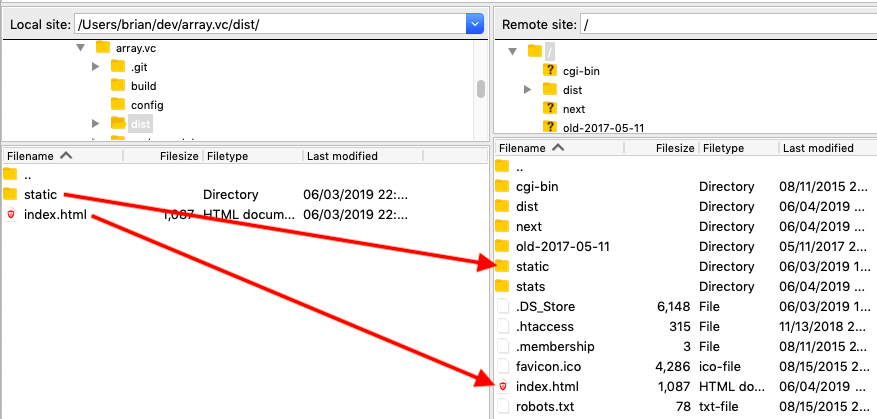

# array-vue

> Source for http://array.vc

## Build :: One time setup
``` bash
# install node version manager - https://github.com/creationix/nvm#installation

nvm install v12
nvm alias default v12

# install dependencies
npm install
```

## Build :: Run a local server
``` bash
# serve with hot reload at localhost:8080
npm run dev

# or, after building, run a server with production build
cd dist && python -m SimpleHTTPServer 8000

```

## Build :: For deployment
``` bash
# build for production with minification
npm run build

```

# Deploying 
## Deploy :: for reals
1. Make sure `assetsPublicPath` in config/index.js is `/` under `build:` section
2. Run `npm run build`
3. FTP `dist/index.html` & `dist/static/` up to the root directory to replace existing
4. Open http://array.vc/ in browser



## Deploy :: for test / next
1. Change `assetsPublicPath` in config/index.js from `/` to `/next` under `build:` section
2. Run `npm run build`
3. FTP `dist/index.html` & `dist/static/` up to the `/next` dir
4. Open http://array.vc/next in browser


## Other
```bash
# build for production and view the bundle analyzer report
npm run build --report
```